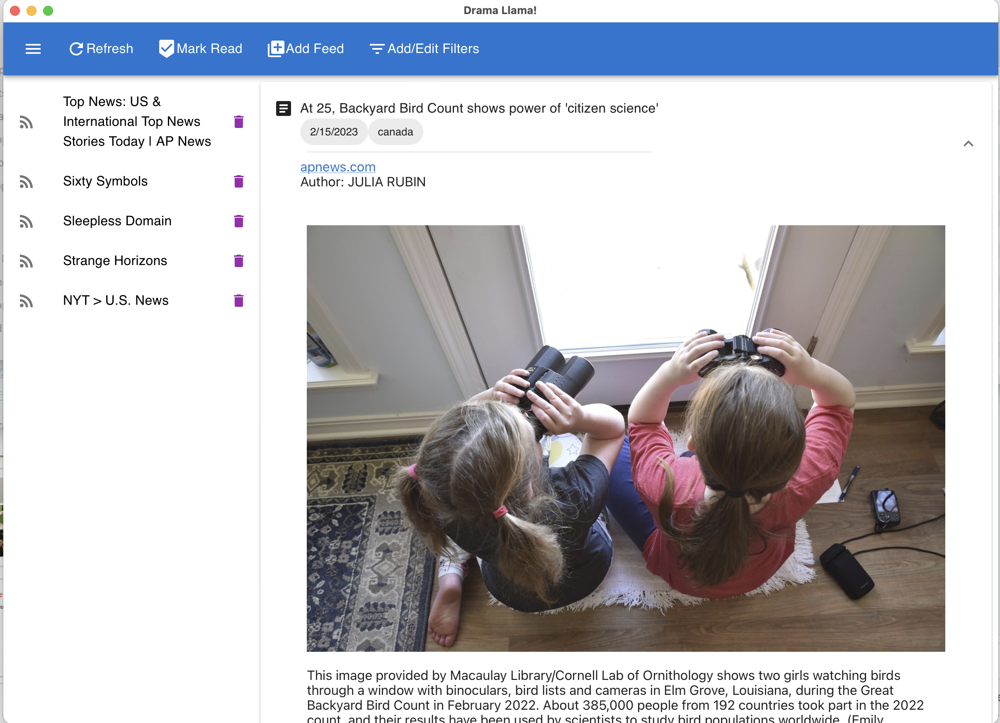

# Drama Llama: Postmortem

[Drama Llama main repo](https://github.com/kaesluder/drama-llama-py)

## The Plan

The original goal coming into capstone was to apply Natural Language Processing to the consumption of social media and news feeds. Big technology companies do this routinely to push content to users and encourage doomscrolling. Given the recent changes and political controversies regarding content moderation, I feel it's quite clear that absent and insufficient content curation by big tech shifts the burden to individual users. This isn't a new problem, discussion of filters and killfiles go all the way back to Usenet and early email lists.

The original plan involved developing an electron app using typescript to handle both backend and frontend logic. Since RSS feeds are notoriously variable, I was leaning to a NoSQL data store. A typescript/typescript framework can use electron inter-process-communication (IPC) for the data flow.

Instead, I ended up doing another flask (python) backend with a javascript frontend. What happened?

## Constraints

I had three weeks to bring a project from proposal to a working demo. In addition, we came home the first friday to find water pouring from ceiling vents due to a plumbing disaster from an upstairs neighbor.

## Dealing with API Churn

One problem I ran into repeatedly was having a set of components that tested well individually but refused to compile and run together. Multiple Nodejs NoSQL libraries depend on LevelDB, and I could not get M1 Mac binaries for those libraries. Typescript worked very well up to the point when library functions started delivering custom data types. Some frameworks wanted ESM imports, while others insisted on CommonJS.

All of these problems could be fixed with more time and expertise, but I felt that debugging babel and webpack configs was not the best use of the limited learning time I had available.

## Did Not Finish: Natural Language Processing

This will be added to a future version. While python created opportunities to use stronger NLP libraries including NLTK and spaCy, developing the download/view features was necessary to make them useful. In the last few days, I adopted a soft freeze on new features to devote time to improving unit testing and documentation quality.

## Success: Hybrid SQLite Model

Going into the project, I thought that I really needed a NoSQL solution. RSS is both not fully standardized and extendible, while my plans for filter design would involve polymorphism. Unfortunately, NoSQL was another area I couldn't figure out within the time constraints.

Eventually, I discovered that SQLite includes SQL extensions for [manipulating JSON field data](https://www.sqlite.org/json1.html). So I adopted SQLite and used a hybrid model of relational fields for data needed for searching and sorting, and raw JSON data for everything else.

## Success: Polymorphic Filters and Filter Storage

I ended up implementing two different filter types. `BaseFilter` says "yes" to everything, while `RegexFilter` says "yes" to posts matching a regex pattern. Each filter is an object that knows how to apply its own criteria to a post, and to communicate what it is to the storage system. Storage is handled by exporting the config to a basic `dict()` and serializing it in an SQL table.

## I'll Take It: Building a Desktop App

I never got Electron working properly. My javascript skills were not up to writing the different dialects expected of Electron and Reactjs.

Electron works by packaging Nodejs with a feature-limited version of Chrome. There are other frameworks implementing the model including [Tauri](https://tauri.app/). Eventually, I just went with [pywebview](https://pywebview.flowrl.com/) which uses a python backend with a webkit front end. A python/webview or rust/webview might be easier on my brain than a nodejs/chromejs framework.

Long-term I'm planning on continuing development for personal/hobby use, and I'm comfortable just running it as a microservice on my personal computer.

## Final Thoughts

It was a great, frustrating, and intense learning experience. Even though I was using a familiar stack, I had to innovate and push my knowledge on how to implement this project. Some takeaways:

1. While I'm big on DIY, I don't feel comfortable doing interface design for others on my own.
2. I'd like to put a lot more work into learning build and development tools instead of depending on boilerplate created by others.
3. I'll probably continue this as a personal project, but it looks like my near future is going to be other languages and application areas.

-- 18 February, 2022
