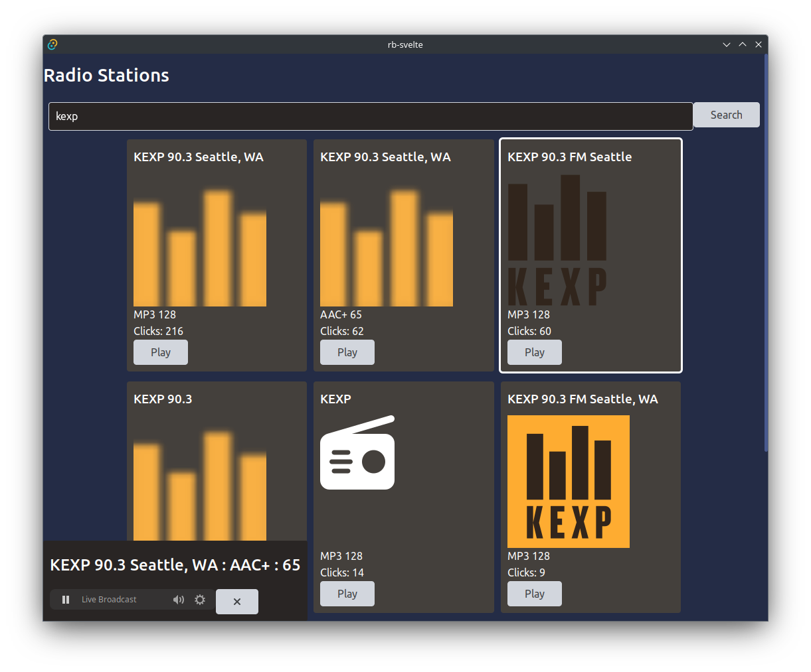

# RadioBrowserGaGa: First steps and impressions

## The Why

> But one fine mornin' she hears a New York station  
> She just didn't believe what she heard at all, hey, not at all  
> She started dancin' to that fine, fine music  
> You know her life is saved by rock 'n' roll  
> Yes, rock 'n' roll
>
> -- The Velvet Underground

One of my favorite memories as an 80s kid was riding with my father on late-night drives. I got to control the radio. On a clear night, AM radio could skip, hop, and jump for hundreds of miles to our car. At home, I never had much of a budget for buying albums, so falling asleep to late-night local FM programming became a habit. In the late 90s, shoutcast, icecast, and low-power community FM offered the curated music experiences that commercial radio abandoned in favor of triangulated marketing playlists and conversion to talk radio.

Why I love streaming radio:

- Often community-supported and curated content
- Deep dive into obscure music genres
- Discover new sounds from around the world
- Trying things I don't like
- Learning things I love (for now)
- No adaptive algorithms that converge on my 20-odd most-listened tracks of the month

## Frameworks



### Tauri

Tauri is a hybrid desktop GUI framework. The user interface can be written in HTML + JavaScript/TypeScript + CSS and displayed in a modified web browser. The "backend" for Tauri is a Rust process that handles the most important IO and operating-system integration. Tauri can bypass the REST api layer using direct inter-process communication (IPC). The design is parallel to electron, which uses Google Chrome for a front-end and nodejs for the backend.

I've been itching to try out tauri since running into issues with electron for my [capstone project](/Ada_Capstone_Documentation/Drama_Llama_Postmortem). My final capstone used a python/webview hybrid instead. With an early look, Rust has many of the features I want in a language: functional programming tools, immutable defaults, less object-oriented abstraction, and greater visibility of data-as-value vs. data-as-reference. And if I'm working on a passion project, it makes sense to use languages that work well with my brainmeats.

### Svelte

Don't have a lot of experience here, so I'll just link to the [Svelte site](https://svelte.dev). First impressions have been very good.

## Some Code Notes

I'm using [radio-browser.info](https://radio-browser.info) as a source for data about known stations, via the [rust api](https://docs.rs/radiobrowser/latest/radiobrowser/)

```rust

#[tauri::command]
fn stations(search_string: &str) -> Vec<JSStation> {
    let api = RadioBrowserAPI::new().expect("Unable to initialize RadioBrowserAPI");
    let limit = String::from("100");
    let stations = api
        .get_stations()
        .name(search_string)
        .order(radiobrowser::StationOrder::Clickcount)
        .reverse(true)
        .limit(limit)
        .send()
        .expect("Unable to download stations.");
    let mut jss: Vec<JSStation> = Vec::new();
    for rb in stations.iter() {
        jss.push(station_convert(rb.clone()));
    }

    return jss;
}
```

I can't (at this time) push records directly from the radio-browser api to JS, so I use a lightweight struct for that:

```rust
struct JSStation {
    name: String,
    stationuuid: String,
    url: String,
    homepage: String,
    favicon: String,
    codec: String,
    bitrate: u32,
    clickcount: u32,
}

fn station_convert(rb_station: ApiStation) -> JSStation {
    let result = JSStation {
        name: rb_station.name,
        stationuuid: rb_station.stationuuid,
        url: rb_station.url,
        homepage: rb_station.homepage,
        favicon: rb_station.favicon,
        codec: rb_station.codec,
        bitrate: rb_station.bitrate,
        clickcount: rb_station.clickcount,
    };
    return result;
}
```

On the TypeScript side, calling rust functions is extremely simple:

```typescript
async function getStations() {
  stations = await invoke('stations', { searchString });
}
```

Some streams listed on radio-browser.info point to a [playlist file](<https://en.wikipedia.org/wiki/PLS_(file_format)>) instead. So I created code to download and decode the playlist file.

```typescript
/**
 * Fetch a remotely hosted playlist and return the raw text.
 *
 * @param url url pointing to a playlist file
 * @returns string contents of playlist or null on failure
 */
export const fetchPlaylistData = async function (
  url: string
): Promise<string | undefined> {
  try {
    const response = await fetch(url, {
      method: 'GET',
      timeout: 30,
      responseType: ResponseType.Text,
    });
    return String(response.data);
  } catch (error) {
    console.log(error);
    return undefined;
  }
};
```

## Next Steps

It's currently a working music player. Next steps include adding a favorites system and setting up automated builds on github.
