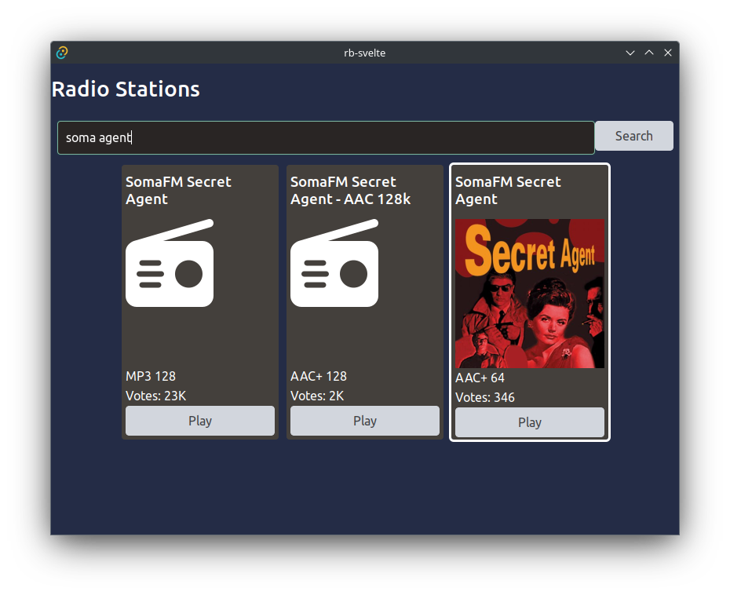

# Radio Browser GaGa: Thanksgiving Week Working Reflections

My turn to do cat sitting this holiday, so a lot of time to work on this project.

## Achievements

- Multiple UI improvements to keep the layout of tiles consistent, and to display votes rather than clicks. (Tailwind)
- Added the ability to search for multiple keywords. The search string "soma agent" reliably brings up [Soma FM Secret Agent Radio](https://somafm.com/secretagent/). (rust)
- Separated post-api processing code from api-call code to make testing easier. One of the disadvantages of rust is the lack of easy mocking tools. There are ways to do it, but I'm holding off until I understand the concepts a bit better. (rust)
- Created a CI pipeline on github to test and produce builds. (github)

## Blockers

- The CI pipeline isn't producing functional linux packages or appimage. I suspect it's due to needing additional gstreamer plugins included in the bundle. I don't know if this will apply to MacOS or Windows yet. It's a low priority for now.
- Can't do unit testing on api calls, yet.

## Next Steps

- Add tag search to search functionality.
- Implement a favorites system.
- More testing.
